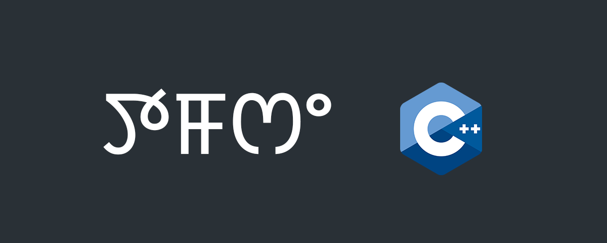

# ꯇꯝꯁꯦ C++

Introduction to **C++** Programming.

C++ is an object oriented, compiled, platform-dependent language. It needs a compiler and GNU C Compiler is a popular one.

What we will do?

1. Install GCC.
2. Write C++ program.
3. Compile and run it.
